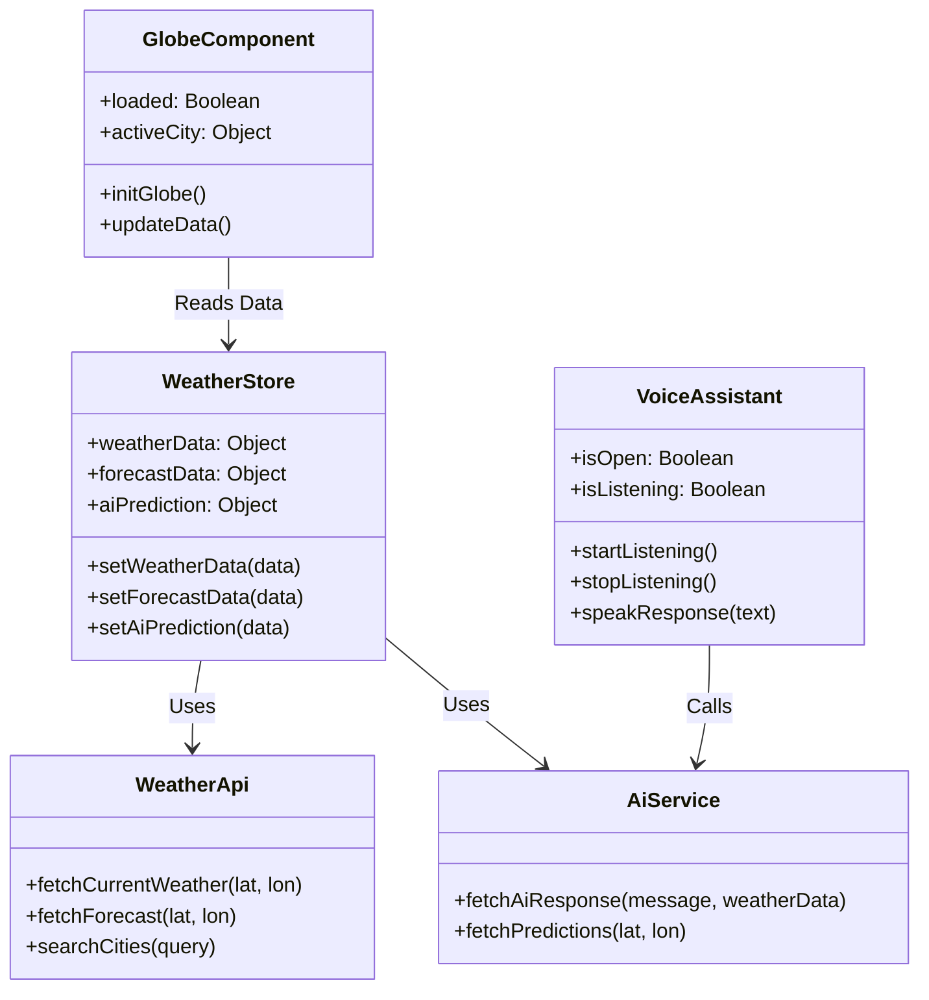

# Chapter 3: UML Diagrams

## 3.1 Class Diagram
The following represents a high-level class diagram concept for the Weather Forecast AI Platform, focusing on the main components and data structures.



## 3.2 Use Case Diagram
The following use case diagram describes the interactions between the user and the system.

```mermaid
useCaseDiagram
    actor User
    actor OpenWeatherAPI
    actor GeminiAPI

    rectangle "Weather Forecast AI Platform" {
        usecase "Search Weather by City" as UC1
        usecase "View Current Weather" as UC2
        usecase "Use Voice Assistant" as UC3
        usecase "Interact with 3D Map" as UC4
        usecase "View AI Predictions" as UC5
        
        User --> UC1
        User --> UC2
        User --> UC3
        User --> UC4
        User --> UC5
        
        UC1 ..> OpenWeatherAPI : Includes
        UC2 ..> OpenWeatherAPI : Includes
        UC3 ..> GeminiAPI : Includes
    }
```
*(Note: Use case diagram syntax in Mermaid is simulated here for structure).*
